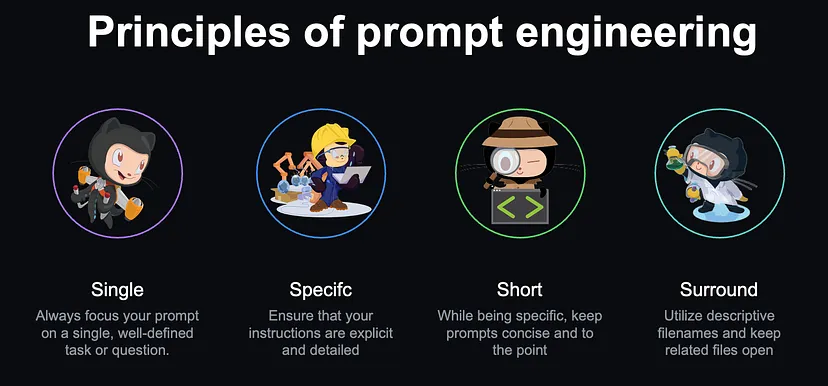

# GitHub Copilot CheatSheet

Version 2 is available here: [copilot-cheat-sheet-v2](copilot-cheat-sheet-v2.md)


## Supported languages and frameworks

GitHub Copilot works on any language, including **Java**, **PHP**, **Python**, **JavaScript**, **Ruby**, **Go**, **C#**, or **C++**. Because it’s been trained on languages in public repositories, **it works for most popular languages, libraries and frameworks**.

- [Quickstart for GitHub Copilot](https://docs.github.com/en/copilot/quickstart)

## Use cases for GitHub Copilot in VS Code

With GitHub Copilot in VS Code you can:

- Get inline code suggestions while you're writing and iterating on code.
- Start a chat conversation to generate or refactor source code, produce documentation comments, or generate unit tests.
- Get help with fixing errors in your code, or resolve errors while running commands in the terminal.
- Ask questions to help ramp-up on a new code base, or accelerate learning a new programming language or framework.
- Use chat features to discover and configure your VS Code setup.

## Main features - Where can I find Copilot?

Everywhere: Code editor, multiple chat modes, CLI, commit messages and pull request summaries.

It is also available in **GitHub Mobile App** and on **GitHub.com**, with a subscription to Copilot Enterprise.

Access Copilot via:

- **Code completions a.k.a. 'ghost text'** - just start typing
    - You can also access Copilot by writing a comment and expressing what you want
    - You can also disable completions in **GitHub Copilot status icon** (to avoid to much 'noise')
- **Chat**
    - **Inline Chat** - <kbd>Ctrl + I</kbd> It gives you what to accept changes first or highlight important code
    - **Quick Chat** - <kbd>Ctrl + Shift + I</kbd>
    - **Side panel Chat** - <kbd>Ctrl + Alt + I</kbd> Solve and brainstorm more complex problems or analyse the codebase, learn new languages and frameworks, multiple chats and docking are also possible
- **Sparkle Icon** - a.k.a Smart actions - quicky invoke copilot in code editor, terminal, commit message and pull request     summary
- **Context menu** - Highlight a code snippet and navigate to Copilot in VS Code context menu


### Essential keyboard shortcuts

- <kbd>Tab</kbd> - Accept the whole suggestion
- <kbd>Esc</kbd> - Dismiss suggestion
- <kbd>Control + -></kbd> - Accept one word only
- <kbd>Control + Enter</kbd> - See alternative suggestions
- <kbd>Alt + ], Alt + [</kbd> - Next/Prev alternative suggestion
- <kbd>Ctrl + L</kbd> - New chat


### Copilot in CLI

This feature requires [GitHUb CLI](https://docs.github.com/en/copilot/managing-copilot/configure-personal-settings/installing-github-copilot-in-the-cli).

```shell
gh copilot explain "sudo apt-get"
gh copilot suggest "undo the last commit"
```

### Copilot in GitHub Mobile

In GitHub Mobile, you can use Copilot Chat to ask:

- General software-related questions, without a particular context. For more information, see "Asking a general question about software development."
- Questions asked in the context of your project. For more information, see "Asking questions about a specific repository."
- Questions about a specific file or specified lines of code within a file. For more information, see "Asking questions about specific pieces of code."

Some examples of general questions you could ask are:

- What are the advantages of the Go programming language?
- What is Agile software development?
- What is the most popular JavaScript framework?
- Give me some examples of regular expressions.
- Write a bash script to output today's date.

More information under this [link](https://docs.github.com/en/copilot/using-github-copilot/asking-github-copilot-questions-in-github-mobile).

### Code completions in the editor

Copilot suggests code as you type. Copilot analyzes the context in the file you're editing and related files, and offers suggestions from within the editor. For example, begin typing the name of a method and Copilot suggests the implementation, following your coding style.

- start with function declaration **function**, **def** to 'wake up' Copilot
- provide more context to get better (less generic) answers

### Answering coding questions

- What is recursion?
- What is complexity of this function?
- What is dependency injection?

#### Provide guidance and support for common coding tasks and challenges

Ask Copilot about syntax or general programming concepts without requiring to navigate documentation or search online forums. Copilot gives responses in natural language format or in code snippet format. For example, you can ask questions such as "what is recursion?" or "how to create a singleton in Java?".

#### Improve code understanding by explaining selected code

Copilot generates natural language descriptions of the code's functionality and purpose. This can be useful if you want to understand the code's behavior or for non-technical stakeholders who need to understand how the code works.

#### Provide guidance that is specific to your codebase

Copilot has the context of your workspace and can give step-by-step guidance and code samples that are tailored to your project. For example, "how to add a contacts page?" or "how do I read customer data from the database?".

Use @workspace to get help tailored to codebase in your project.

### Code refactoring and improvements

#### Provide suggestions for implementing code refactorings

Copilot suggests refactorings using the context of your codebase. For example, ask Copilot to refactor a function to not use recursion, or to suggest an algorithm that can improve performance.

#### Suggest potential improvements to selected code

Such as improved handling of errors and edge cases, or changes to the logical flow to make the code more readable.

### Fix issues/refactor and debug code and code inline

Highlight the code you want to fix, right click, and select “Fix using Copilot.” Copilot will then provide you with a suggested fix for your code.

#### Propose a fix for bugs in your code (also Vulenrability detection)

With the **/fix** command by suggesting code snippets and solutions based on the context of the error or issue. For example, if your code produces an error message or warning, Copilot Chat can suggest possible fixes based on the error message, the code's syntax, and the surrounding code. The changes might consist of changes to variables, control structures, or function calls that could resolve the issue.

Copilot model targets the most common vulnerabilities coding patterns like hard coded credentials, sql injections, and path injections. The system leverages LLMs to approximate the behavior of static analysis tools and can even detect vulnerabilities patterns in incomplete fragments of code. This means insecure coding patterns can be quickly blocked and replaced by better suggestions before they ever appear in the editor. Copilot code should still be reviewed and tested before being merged into the codebase. 


#### Suggest terminal command fixes

When a command fails to run in the terminal, Copilot displays a sparkle in the gutter that offers a Quick Fix to explain what happened.

#### Suggest terminal command fixes

Utilize GitHub Copilot Chat to run commands right in your terminal (e.g. from chat window).

### Jumpstart your project

#### Generate a new VS Code workspace

For your choice of technologies with /new to get started quickly with a new project. Pick and choose your technology stack, preview the workspace files, and let Copilot scaffold the entire workspace for you.

#### Scaffold a new Jupyter notebook by using natural language

Generate a new notebook that is preconfigured based on a description by using /newNotebook. For example, to scaffold a new notebook that loads, inspects, and visualizes a sample dataset, prompt Copilot with "@workspace /newNotebook read titanic dataset with pandas, display key values with seaborn".

### Generate unit test cases or practice Test-driven Development (TDD)

E.g. You can write test before implementation.

#### Write unit test cases for your test framework

Based on the code open in the editor or the code snippet you highlight in the editor. Copilot identifies your test framework and coding style and generates matching code snippets.

#### Identify and write test cases for edge cases and boundary conditions

Copilot can suggest test cases for error handling, null values, or unexpected input types.

#### Suggest assertions

Suggest assertions that ensure the function is working correctly, based on the code's context and semantics. For example, generate assertions to ensure that function input parameters are valid.

### Generate code documentation

Generate code documentation for multiple languages for the code open in the editor or the code snippet you highlight in the editor. Use /doc or a Copilot smart action to help you generate meaningful code documentation.

### Improve your productivity in VS Code

#### AI-generated commit messages and PR descriptions

Based on the code changes in a commit or the changes in a pull request. Use the sparkle button in the Source Control view or GitHub PR extension to generate a title and description that summarizes your changes.

#### Ask help in the Command Palette

To help you find the relevant command in VS Code. You can describe the functionality and Copilot can help identify the matching functionality. For example, type "code preview in scrollbar" in the Command Palette, and Copilot can identify that you're referring to the editor.minimap settings.

#### Use terminal inline chat

To ask questions about the terminal or how to use specific shell commands. For example, you can ask questions such as "list the top 5 largest files in the src directory", or "how to enable shell integration".

#### AI-generated rename suggestions

For symbols in your source code. When you rename a symbol in your code, Copilot suggests a new name based on the context of the symbol and the codebase.

### Assisting non-native English speakers

GitHub Copilot can understand other languages beyond English. Additionally, GitHub Copilot helps translate words from English to other languages.

### Creating data (e.g. dictionaries with lookup data)

E.g. Create a dictionary with countries and their capitals.
E.g. Create a dictionary with countries and their capitals in english and polish.

```
Produce IO exemplars for sentiment analysis. Examples are categorized as either positive or negative. 
Produce 2 negative examples and 8 positive examples. 
Use this format for the examples:
Q:
A:
```

### Matching patterns with regular expressions

E.g.: 'Create a regex to validate phone number in this format (xxx) xxx-xxxx'.

### Working with external APIs

E.g.: "Write a function to retrieve dog breeds from following API 'https://dog.ceo/api/breed/' and return an array of breed objects".

Activate GitHub Copilot and use it to generate ideas on how to solve the problem better.

### Preparing for technical interviews

LeetCode etc.

### Navigating a new codebase

Open any project, use *@workspace* agent and start asking questions about codebase.

### Run terminal commands from GitHub Copilot Chat

With the **@terminal** agent in VS Code, you can ask GitHub Copilot how to run a particular command. Once it generates a response, you can then click the “Insert into Terminal” button to run the suggested command.

In **GitHub CLI** you can use:
```bash
gh copilot explain "sudo apt-get"
```

### Write pull request summaries (Copilot Enterprise feature only)

GitHub Copilot is integrated into pull requests.

### Generate commit messages

I came across this one recently while making changes in VS Code. GitHub Copilot can help you generate commit messages right in your IDE. If you click on the source control button, you’ll notice a sparkle in the message input box.

### Get help in the terminal with GitHub Copilot in the CLI

This is an extension to GitHub CLI that helps you with general shell commands, Git commands, and gh cli commands.

Common use cases:
- Find the right command to perform a task
- Explain an unfamiliar command

### Talk to your repositories on GitHub.com (Copilot Enterprise feature only)

You can now use GitHub Copilot Chat to explain the repository to you, right in GitHub.com. Just click on the Copilot icon in the top right corner of the repository and ask whatever you want to know about that repository.

### Bulk close 1000+ GitHub Issues

Implement custom GitHub action to automate a tedious task.

### Get help with error messages in your terminal

Error messages can often be confusing. With GitHub Copilot in your IDE, you can now get help with error messages right in the terminal. Just highlight the error message, right click, and select “Explain with Copilot.” GitHub Copilot will then provide you with a description of the error and a suggested fix.

### Solve LeetCode problems

- Install [LeetCode VS Code extension](https://marketplace.visualstudio.com/items?itemName=LeetCode.vscode-leetcode)
- Open the `leetcode` extension
- Select a problem to solve
- Start the coding exercise
- Use the problem descption from leetcode with Copilot Chat (copy & paste), ask it to create the code
- Use the right click pop-up menu in the solutions file to test and submit your solution to leetcode

### Debug your GitHub Actions workflow

Copilot can help you write and debug GitHub actions.

### Exit Vim

```
How do I exit Vim?
```

#### References

- [GitHub Copilot in VS Code](https://code.visualstudio.com/docs/copilot/overview)
- [GitHub Copilot Quickstart](https://code.visualstudio.com/docs/copilot/getting-started)
- [Copilot Chat Tutorial](https://code.visualstudio.com/docs/copilot/getting-started-chat)
- [GitHub Copilot Discussions](https://github.com/orgs/community/discussions/categories/copilot?discussions_q=is%3Aopen++category%3ACopilot+)
- [GitHub Copilot Blog](https://github.blog/changelog/label/copilot/)
- [8 things you didn’t know you could do with GitHub Copilot](https://github.blog/developer-skills/github/8-things-you-didnt-know-you-could-do-with-github-copilot/)
- [10 unexpected ways to use GitHub Copilot](https://github.blog/developer-skills/programming-languages-and-frameworks/10-unexpected-ways-to-use-github-copilot/)
- [Use Copilot to Write and Translate a Binary Search Algorithm](https://dev.to/github/use-copilot-to-write-and-translate-a-binary-search-algorithm-lcm)
- [GitHub Copilot in the CLI](https://docs.github.com/en/copilot/responsible-use-of-github-copilot-features/responsible-use-of-github-copilot-in-the-cli)


### Slash Commands

<kbd>/help</kbd> - display all slash commands and agents (participants)


| Command   | Description                                                  | Usage                                                                                                              |
|-----------|--------------------------------------------------------------|--------------------------------------------------------------------------------------------------------------------|
| <kbd>/explain</kbd>  | Get code explanations                                        | Open file with code or highlight code you want explained and type:<br>/explain what is the fetchPrediction method? |
| <kbd>/fix</kbd>       | Receive a proposed fix for the problems in the selected code | Highlight problematic code and type:<br>/fix propose a fix for the problems in fetchAirports route                 |
| <kbd>/tests</kbd>     | Generate unit tests for selected code                        | Open file with code or highlight code you want tests for and type:<br>/tests                                       |
| <kbd>/help</kbd>      | Get help on using Copilot Chat                               | Type:<br>/help what can you do?                                                                                    |
| <kbd>/clear</kbd>     | Clear current conversation                                   | Type:<br>/clear                                                                                                    |
| <kbd>/doc</kbd>      | Add a documentation comment                                  | Highlight code and type:<br>/doc<br>You can also press Ctrl+I in your editor and type /doc/ inline                  |
| <kbd>/generate</kbd>  | Generate code to answer your question                        | Type:<br>/generate code that validates a phone number                                                              |
| <kbd>/optimize</kbd>  | Analyze and improve running time of the selected code        | Highlight code and type:<br>/optimize fetchPrediction method                                                       |
| <kbd>/clear</kbd>     | Clear current chat                                           | Type:<br>/clear                                                                                                    |
| <kbd>/new</kbd>       | Scaffold code for a new workspace                            | Type:<br>/new create a new django app                                                                              |
| <kbd>/simplify</kbd>  | Simplify the selected code                                   | Highlight code and type:<br>/simplify                                                                              |
| <kbd>/feedback</kbd>  | Provide feedback to the team                                 | Type:<br>/feedback                                                                                                 |

### Agents (participants)

- **@workspace** - ask a questions related to your actual workspace
- **@terminal** - ask a questions related to info in your terminal
- **@vscode** - ask the questions related to VS Code
- **@github** - get answers grounded in web search, code search, and your enterprise's knowledge bases

### Variables

- **#codebase**: the contents of the current workspace. It includes information about the files and folders in your workspace, as well as any settings or configurations specific to that workspace.
- **#editor**: the code in the active editor. The editor content is implicitly included in the Chat view context.
- **#file**: include a specified file in your workspace as context with your chat prompt.
- **#git**: information about the current git repository, such as the workspace folder, branch name, remotes, and more.
- **#selection**: the visible source code in the active editor.
- **#terminalLastCommand**: the active terminal's last run command.
- **#terminalSelection**: the active terminal's selection.

---

## Copilot in Action

### Basics

#### Ask a question

Use valid comment style from you programming language.

```javascript
// q: Explain Onion Architecture.
// q: How to cook a beef stew? ;)
```

#### Code suggestions in IDE - basics

- Suggestions appear as you type.
- Accept whole suggestion with <kbd>Tab</kbd>.
- Accept word by word <kbd>Ctrl + -></kbd>.
- Navigate through multpile solutions (Completion Panel) with <kbd>Ctrl + Enter</kbd>.
- Guide Copilot with **instructions within the function** to provide conditions, assertions and so on.
- Inline chat <kbd>Ctrl + I</kbd> might be better than "ghost text" in many cases.
- Don't recreate common prompts - use **slash commands**.
- Don't forget about context.

#### Work with regular expressions (regex)

```javascript

// regex to match the phone number in the format (xxx) xxx-xxxx

// test phoneRegex against the phone number with console.log

```

#### Work with SQL queries

Define data structure (e.g. struct, class) like Product(Id, Name, Price, Description) for best results.
```
Generate sql to insert Product object into database.
```

#### Work with extenral APIs

#### Use @file to provide context of specific file

E.g. Use sample.json file to generate a strongly typed class or interface.

#### Unit testing

```javascript
// test caclulator function
// create unit test for a calculator function using assert/jest framework
```

---

## Copilot rules of engagement

### Stay smart and use Copilot don't let copilot fly the plane

The LLMs behind generative AI coding tools are designed to find and extrapolate patterns from their training data, apply those patterns to existing language, and then produce code that follows those patterns. Given the sheer scale of these models, they might generate a code sequence that doesn’t even exist yet.
 
**Just as you would review a colleague’s code, you should always assess, analyze, and validate AI-generated code.**

Copilot is going to latch on to your code to generate suggestions that follow the existing pattern, so the adage "garbage in, garbage out" applies.

### Beyond the completions

**Context, context, context**

If you understand Large Language Models (LLMs), you will know that they are designed to make predictions based on the context provided. This means, the more contextually rich our input or prompt is, the better the prediction or output will be.

#### Be specific and keep it simple

When you ask Copilot to do something, be specific in your ask and break down a large task into separate, smalller tasks. For example, don't ask Copilot to create an Express app, that uses TypeScript and Pug, and that has a products page that retrieves data from a MongoDB database. Instead, first ask Copilot to create the Express app with TypeScript and Pug. Next, ask to add a products page, and finally ask to retrieve the customer data from a database.

#### Iterate on your solution

When asking Copilot Chat for help, you aren't stuck with the first response. You can iterate and prompt Copilot to improve the solution. Copilot has both the context of the generated code and also your current conversation.

#### Open your relevant files

Having your files open provides GitHub Copilot with context. When you have additional files open, it will help to inform the suggestion that is returned. Remember, if a file is closed, GitHub Copilot cannot see the file’s content in your editor, which means it cannot get the context from those closed files.

#### Provide a top-level comment

Just as you would give a brief, high-level introduction to a coworker, a top-level comment in the file you’re working in can help GitHub Copilot understand the overall context of the pieces you will be creating—especially if you want your AI assistant to generate the boilerplate code for you to get going.

#### Set appropriate includes and references

It’s best to manually set the includes/imports or module references you need for your work, particularly if you’re working with a specific version of a package.

#### Meaningful function names matter

The name of your variables and functions matter. If you have a function named foo or bar, GitHub Copilot will not be able to give you the best completion because it isn’t able to infer intent from the names.

#### Provide specific and well-scoped function comments

Commenting your code helps you get very specific, targeted suggestions.
Single, specific, short comments help GitHub Copilot provide better context.

#### Provide sample code

Providing sample code to GitHub Copilot will help it determine what you’re looking for. This helps to ground the model and provide it with even more context.

#### Inline chat is usually more flexible than comments and "ghost text"

By pressing <kbd>Cmd + I</kbd> (<kbd>Ctrl + I</kbd> on Windows) you’ll have Copilot right there to ask questions. This is a bit more convenient for quick fixes instead of opening up GitHub Copilot Chat’s side panel.

#### Remove irrelevant requests in chat side-panel

You can delete a previously asked question in the chat interface to remove it from the indexed conversation - especially if it is no longer relevant.

#### Navigate through your conversation

Another tip is to use the up and down arrows to navigate through your conversation with GitHub Copilot Chat. You can just use my **keyboard arrows** just like in the terminal!

#### Use chat agent and participants

The **@workspace** agent for example, is aware of your entire workspace and can answer questions related to it. 

Use **@vscode** to know more about VS Code features and APIs.

#### Highlight relevant code

Highlight relevant code in your files before asking it questions. This will help to give targeted suggestions and just provides the assistant with more context into what you need help with.

#### Organize your conversations with threads

You can have multiple ongoing conversations with GitHub Copilot Chat on different topics by isolating your conversations with threads. We’ve provided a convenient way for you to start new conversations (thread) by clicking the ** + ** sign on the chat interface.

#### Use slash commands for common tasks

Don't reinvent the wheel. Copilot have commands to help you explain code, fix code, create a new notebook, write tests, and many more. They are just shortcuts to common prompts that we’ve found to be particularly helpful in day-to-day development from our own internal usage.

#### Attach relevant files for reference (chat variables)

In Visual Studio and VS Code, you can attach relevant files for GitHub Copilot Chat to reference by using **#file**. This scopes GitHub Copilot to a particular context in your code base and provides you with a much better outcome.

You can also add context to your chat message by using the Attach Context button in the Chat view. You can then select the specific type of context from a Quick Pick, such as the current selection, one or more files from the workspace, or one or more symbols from your source code.

#### Be on the lookout for sparkles

In VS Code, you can quickly get help from GitHub Copilot by looking out for “magic sparkles.” For example, in the commit comment section, clicking the magic sparkles will help you generate a commit message with the help of AI. You can also find magic sparkles inline in your editor as you’re working for a quick way to access GitHub Copilot inline chat.

#### Use voice interactions

With the voice control capabilities in VS Code, provided by the VS Code Speech extension, you can initiate a chat conversation by using your voice:

- Use your voice to dictate your chat prompt
- Use the "Hey Code" voice command to start a voice session with Copilot Chat
- Accelerate voice input for chat by using the "hold to speak" mode

#### Don't ignore feedback features

Copilot is always incrementally improve and is always learning - use feedback tools like :thumbsup: or :thumbsdown:.

##### References

- [Tips, tricks, and best practices](https://github.blog/developer-skills/github/how-to-use-github-copilot-in-your-ide-tips-tricks-and-best-practices/)
- [Best practices for using GitHub Copilot in VS Code](https://code.visualstudio.com/docs/copilot/prompt-crafting)
- [Effective Prompting for GitHub Copilot](https://www.youtube.com/watch?v=ImWfIDTxn7E)
- [Pragmatic techniques to get the most out of GitHub Copilot](https://www.youtube.com/watch?v=CwAzIpc4AnA)
- [Best practices for prompting GitHub Copilot in VS Code](https://www.linkedin.com/pulse/best-practices-prompting-github-copilot-vs-code-pamela-fox/)
- [How to use GitHub Copilot: Prompts, tips, and use cases](https://github.blog/developer-skills/github/how-to-write-better-prompts-for-github-copilot/)

---

## Prompt crafting




- Provide good **context**; giving examples and information about what you're trying to achieve
- Be **specific**; if it's for a certain audience, say that
- **Break down** the problem
- Be **clear** in how you ask your questions. If something comes back that doesn't sound right, clarify it
- **Rephrase and refine** for your prompts


### 3S Principle of Prompt Engineering

- **Simple**
    - The more code - the more errors and hallucinations
    - Break your solution in simple steps
    - Use 'simple' word in prompt
    - Keep relevant files open
    - The best prompt is one you don't have to write
- **Specific**  
    - Don't ask open question
    - Use '@workspace' agent to focus on your project as a base for agents (especially in Chat window)
    - Use includes like '#editor', '#file', '#selection' or '#terminalLastCommand'
    - Always use specific context and specific prompts
- **Short**
    - You don't need to phrase long question
    - You don't need to use proper grammar
    - Type less because typos don't matter
    - Command-like prompts are OK

Simple, specific and short:
```
fixed header
fixed footer
main content scrolls between header and footer
```     
Notice three short prompts insted of large one.

### Prompting tips & Trics

- Provide context
- Be predictable (standard naming conventions etc.)
- Keep relevant files open (source code, input files, even data files like json/xml)
- Provide description on top of the file (E.g. This file parses xyz.json file)
- Provide imports/usings etc. for specific packages, namespaces or libraries
- Provide specific and desriptive variable, type, function and parameter names
- Give inline hints (in comments inside functions)
- Double check code against documentation
    - If code or syntax provided by Copilot is from older version of langauge or library - copy and paste a more up-to-date example from documentation
- Start code generation by defining proper data/entity models, schemas, data structures etc. (e.g. while using MVC pattern)

### Basic techniques

- Neighboring Tabs
- Zero-Shot Prompting
- One-Shot Prompting
- Few-Shot Prompting
- Role Prompting
- Let's Think Step by Step

### Set the stage with a high-level goal, then get specific

This is most helpful if you have a blank file or empty codebase. In other words, if GitHub Copilot has zero context of what you want to build or accomplish, setting the stage for the AI pair programmer can be really useful.

```
/*
Create a basic markdown editor in Next.js with the following features:
- Use react hooks
- Create state for markdown with default text "type markdown here"
- A text area where users can write markdown
- Show a live preview of the markdown text as I type
- Support for basic markdown syntax like headers, bold, italics
- Use React markdown npm package
- The markdown text and resulting HTML should be saved in the component's state and updated in real time
*/
```

### Make your ask simple and specific. Aim to receive a short output from GitHub Copilot.

Once you communicate your main goal to the AI pair programmer, articulate the logic and steps it needs to follow for achieving that goal.

When writing a prompt for Copilot, first give Copilot a broad description of the goal or scenario. Then list any specific requirements.

For example:

- Write a function that tells me if a number is prime
- The function should take an integer and return true if the integer is prime
- The function should error if the input is not a positive integer

### Break complex tasks into simpler tasks

If you want Copilot to complete a complex or large task, break the task into multiple simple, small tasks.

For example, instead of asking Copilot to generate a word search puzzle, break the process down into smaller tasks, and ask Copilot to accomplish them one by one:

- Write a function to generate a 10 by 10 grid of letters.
- Write a function to find all words in a grid of letters, given a list of valid words.
- Write a function to that uses the previous functions to generate a 10 by 10 grid of letters that contains at least 10 words.
- Update the previous function to print the grid of letters and 10 random words from the grid.

### Avoid ambiguity

Avoid ambiguous terms. For example, don’t ask "what does this do" if "this" could be the current file, the last Copilot response, or a specific code block. Instead, be specific:

- What does the createUser function do?
- What does the code in your last response do?

Ambiguity can also apply to libraries:

- If you are using an uncommon library, describe what the library does.
- If you want to use a specific library, set the import statements at the top of the file or specify what library you want to use.

### Give GitHub Copilot an example or two.

```
// Map through an array of arrays of objects
// Example: Extract names from the data array
// Desired outcome: ['John', 'Jane', 'Bob']
```

Use examples to help Copilot understand what you want. You can provide example input data, example outputs, and example implementations.

For example:

Write a function that finds all dates in a string and returns them in an array. Dates can be formatted like:

- 05/02/24
- 05/02/2024
- 5/2/24
- 5/2/2024
- 05-02-24
- 05-02-2024
- 5-2-24
- 5-2-2024

Example:

findDates("I have a dentist appointment on 11/14/2023 and book club on 12-1-23")

Returns: ["11/14/2023", "12-1-23"]

Unit tests can also serve as examples. Before writing your function, you can use Copilot to write unit tests for the function. Then, you can ask Copilot to write a function described by those unit tests.

#### Example 1 - Zero-shot vs One-shot

```
// zero-shot
Write me unit tests for all the operations in my calculator.js file

// one-shot
Write me unit tests for all the operations in my calculator.js file
Use the following example: test(‘adds 1 + 2 to equal 3’, () => ( expect(calculate(1, 2 ‘+’)).toBe(3); });
```

#### Example 2 - Zero-shot vs One-shot

```
// zero-shot
Can you create an HTML calculator for me?

// one-shot
Can you create an HTML calculator for me? Use the following example:  
<!DOCTYPE html>
<html>
  <head>
    <title>Calculator</title>
    <link rel="stylesheet" href="style.css">
  </head>
<body> 
```

#### Example 3 - Zero-shot vs One-shot
```
Zero-shot “Can you write me the code for a snake game?“
One-Shot “Can you write me the code for a snake game? Example: Ensure that there is a leaderboard mechanic“
```

### Indicate relevant code

If you are using Copilot in your IDE to get suggestions as you code, open any relevant files and close irrelevant files. Copilot will use the open files to understand your request.

If you are using Copilot Chat in your IDE, open the file or highlight the code that you want Copilot to reference. You can also specify which files Copilot Chat should reference. For example, in VS Code, use the #file variable or the @workspace participant.

### Experiment and iterate with your prompts

Just how conversation is more of an art than a science, so is prompt crafting. So, if you don’t receive what you want on the first try, recraft your prompt by following the best practices above.

- If you don’t get the result that you want, iterate on your prompt and try again.
- If you are using Copilot to get suggestions as you code, you can delete the suggestion entirely and start over. Or you can keep the suggestion and request modifications.
- If you are using Copilot Chat, you can reference the previous response in your next request. Or, you can delete the previous response and start over.

### Keep a couple of relevant tabs open

We don’t have an exact number of tabs that you should keep open to help GitHub Copilot contextualize your code, but from our experience, we’ve found that one or two is helpful.

### Keep history relevant

Copilot Chat uses the chat history to get context about your request. To give Copilot only the relevant history:

- Use threads to start a new conversation for a new task
- Delete requests that are no longer relevant or that didn’t give you the desired result

### Follow good coding practices

That includes providing descriptive variable names and functions, and following consistent coding styles and patterns.

If you aren't getting the responses you want when you ask Copilot for suggestions or explanations in your codebase, make sure that your existing code follows best practices and is easy to read. For example:

- Use a consistent code style and patterns
- Use descriptive names for variables and functions
- Comment your code
- Structure your code into modular, scoped components
- Include unit tests

Tip: Use Copilot to help your code follow best practices. For example, ask Copilot to add comments or to break a large function into smaller functions.

### Q&A Strategy Prompt

```
@workspace Propose a file/folder structure for this project. Ask me a series of yes/no questions that will help you provide a better recommendation.
```

### Pros and Cons Prompt

```
What are a few different ways that I can implement this db connection logic. Give me the pros and cons of each strategy. #file:DbRepository.ts
```

### Stepwise Chain of Thought Prompt

```
help me refactor the code in #file:ProductService.ts. Go one step at a time. Do not move to the next step until i give the keyword "next". Begin. 
```

### Role Prompt

```
You are a skilled instructor who makes complex topics easy to understand. You come up with fun exercises so that your students can learn by doing. Your goal is to teach students to be proficient with regex. Move one step at a time and wait for the student to provide the correct answer before you move on to the next concept If the student provides the wrong answer, give them a hint. Begin.
```

### More prompting techniques

- Zero-shot Prompting
- Few-shot Prompting
- Chain-of-Thought Prompting
- Self-Consistency
- Generate Knowledge Prompting
- Prompt Chaining
- Tree of Thoughts
- Retrieval Augmented Generation
- Automatic Reasoning and Tool-use
- Automatic Prompt Engineer
- Active-Prompt
- Directional Stimulus Prompting
- Program-Aided Language Models
- ReAct
- Reflexion
- Multimodal CoT
- Graph Prompting

### Example prompts for Copilot Chat

#### Ask general software questions

You can ask Copilot Chat general software questions. For example:

- <kbd>tell me about nodejs web server frameworks</kbd>
- <kbd>how to create an express app</kbd>
- <kbd>@terminal how to update an npm package</kbd>

#### Ask questions about your project

You can ask Copilot Chat questions about your project:

- <kbd>what sorting algorithm does this function use</kbd>
- <kbd>@workspace how are notifications scheduled</kbd>
- <kbd>#file:gameReducer.js #file:gameInit.js how are these files related</kbd>

To give Copilot the correct context, try some of these strategies:

- <kbd>Highlight relevant lines of code</kbd>
- <kbd>Use chat variables like #selection, #file, #editor, #codebase, or #git</kbd>
- <kbd>Use the @workspace chat participant</kbd>

#### Write code

You can ask Copilot to write code for you. For example:

- <kbd>write a function to sum all numbers in a list</kbd>
- <kbd>add error handling to this function</kbd>
- <kbd>@workspace add form validation, similar to the newsletter page</kbd>

When Copilot returns a code block, the response includes options to copy the code, or to insert the code at your cursor, into a new file, or into the terminal.

#### Set up a new project

Use the /new slash command to set up a new project. For example:

- <kbd>/new react app with typescript</kbd>
- <kbd>/new python django web application</kbd>
- <kbd>/new node.js express server</kbd>

Copilot will suggest a directory structure and provide a button to create the suggested files and contents. To preview a suggested file, select the file name in the suggested directory structure.

Use the /newNotebook slash command to set up a new Jupyter notebook. For example:

- <kbd>/newNotebook retrieve the titanic dataset and use Seaborn to plot the data</kbd>

#### Fix, improve, and refactor code

If your active file contains an error, use the /fix slash command to ask Copilot to fix the error.

You can also make general requests to improve or refactor your code.

- <kbd>how would you improve this code?</kbd>
- <kbd>translate this code to C#</kbd>
- <kbd>add error handling to this function</kbd>

#### Detect security issues and propose remediations

```
This code looks insecure. Help me understand the issue and how to resolve it.
```


#### Write tests

Use the /tests slash command to ask Copilot to write tests for the active file or selected code. For example:

- <kbd>/tests</kbd>
- <kbd>/tests using the Jest framework</kbd>
- <kbd>/tests ensure the function rejects an empty list</kbd>

The /tests slash command writes tests for existing code. If you prefer to write tests before writing code (test driven development), omit the /tests command. For example:

- <kbd>Add tests for a JavaScript function that should sum a list of integers</kbd>

#### Ask questions about Visual Studio Code

Use the @vscode chat participant to ask specific questions about Visual Studio Code. For example:

- <kbd>@vscode tell me how to debug a node.js app</kbd>
- <kbd>@vscode how do I change my Visual Studio Code colors</kbd>
- <kbd>@vscode how can I change key bindings</kbd>

#### Ask questions about the command line

Use the @terminal chat participant to ask specific questions about the command line. For example:

- <kbd>@terminal find the largest file in the src directory</kbd>
- <kbd>@terminal #terminalLastCommand to explain the last command and any errors</kbd>

#### Copilot on GitHub Mobile

- <kbd>Explain this file</kbd>
- <kbd>Summarize this issue</kbd>
- <kbd>What changes are introduced in this PR?</kbd>
- <kbd>How can I improve these changes?</kbd>
- <kbd>What's the latest release in this repo?</kbd>
- <kbd>What are the key points in this discussion?</kbd>

##### References

- [Prompt engineering for GitHub Copilot](https://docs.github.com/en/copilot/using-github-copilot/prompt-engineering-for-github-copilot)
- [Example prompts for Copilot Chat](https://docs.github.com/en/copilot/using-github-copilot/example-use-cases/example-prompts-for-copilot-chat)
- [Prompting Techniques](https://www.promptingguide.ai/techniques)
- [Prompt crafting](https://code.visualstudio.com/docs/copilot/prompt-crafting)
- [How to write better prompts](https://github.blog/developer-skills/github/how-to-write-better-prompts-for-github-copilot/)
- [How to use GitHub Copilot: Prompts, tips, and use cases](https://github.blog/developer-skills/github/how-to-write-better-prompts-for-github-copilot/)
- [Essential AI prompts & strategies for developers](https://www.youtube.com/watch?v=H3M95i4iS5c)
- [Prompting with Copilot](https://www.youtube.com/watch?v=ImWfIDTxn7E)
- [Awesome ChatGPT Prompts](https://github.com/f/awesome-chatgpt-prompts)


---

## Bibliography

<details>
    <summary>Basics</summary>

- [Features](https://github.com/features/copilot)
- [GitHub Copilot in VS Code - Extension](https://marketplace.visualstudio.com/items?itemName=GitHub.copilot)
- [GitHub Copilot in VS Code - Overview](https://code.visualstudio.com/docs/copilot/overview)
- [Getting started with GitHub Copilot in VS Code](https://code.visualstudio.com/docs/copilot/getting-started)
- [Getting started with GitHub Copilot Chat in VS Code](https://code.visualstudio.com/docs/copilot/getting-started-chat)
- [Code completions with GitHub Copilot in VS Code](https://code.visualstudio.com/docs/copilot/ai-powered-suggestions)
- [Using Copilot Chat in VS Code](https://code.visualstudio.com/docs/copilot/copilot-chat)
- [Copilot Chat in your workspace](https://code.visualstudio.com/docs/copilot/workspace-context)

</details>

<details>
    <summary>Prompt engineering</summary>

- [A Beginner's Guide to Prompt Engineering with GitHub Copilot](https://dev.to/github/a-beginners-guide-to-prompt-engineering-with-github-copilot-3ibp)
- [Prompt engineering for AI](https://dev.to/github/prompt-engineering-for-ai-what-is-prompt-engineering-and-how-to-get-good-results-from-ai-engines-5ch6)
- [How GitHub Copilot is getting better at understanding your code](https://github.blog/ai-and-ml/github-copilot/how-github-copilot-is-getting-better-at-understanding-your-code/)
- [Prompt Engineering Guide](https://www.promptingguide.ai/)
-[Master the core principles of prompt engineering with GitHub Copilot](https://www.youtube.com/watch?v=hh1nOX14TyY)
</details>

<details>
    <summary>Blogs</summary>

- [GitHub Copilot Blog](https://github.blog/tag/github-copilot/)
- [Copilot code suggestions in IDE](https://docs.github.com/en/copilot/using-github-copilot/getting-code-suggestions-in-your-ide-with-github-copilot)
- [Chat in IDE](https://docs.github.com/en/copilot/using-github-copilot/asking-github-copilot-questions-in-your-ide)

</details>

<details>
    <summary>Sessions</summary>

- [GitHub Copilot Series](https://www.youtube.com/playlist?list=PLj6YeMhvp2S5_hvBl2SE-7YCHYlLQ0bPt)
- [GitHub Copilot in VSCode: Top 10 Features Explained](https://www.youtube.com/watch?v=2nPoiUJpDaU)
- [Easy web deployment with GitHub Copilot](https://www.youtube.com/watch?v=w-K6awH2TEM)
- [Copilot Best Practices (What Not To Do)](https://www.youtube.com/watch?v=2q0BoioYSxQ&t)

</details>


<details>
    <summary>Tips and Tricks</summary>

- https://github.com/github/copilot-hack/blob/main/copilot-tips.md
- https://github.blog/developer-skills/github/how-to-use-github-copilot-in-your-ide-tips-tricks-and-best-practices/
- https://github.blog/developer-skills/github/how-to-write-better-prompts-for-github-copilot/
- https://medium.com/@lars.vandedonk/10-tips-and-tricks-to-master-github-copilot-9b28625a2041
- https://code.visualstudio.com/docs/copilot/prompt-crafting
- https://docs.github.com/en/copilot/using-github-copilot/prompt-engineering-for-github-copilot
- https://learn.microsoft.com/en-us/visualstudio/ide/copilot-chat-context?view=vs-2022
- https://medium.com/@arikbidny/mastering-github-copilot-essential-tips-tricks-and-prompt-engineering-for-optimal-coding-efd420864c3d
- https://www.linkedin.com/pulse/github-copilot-best-practices-tips-tricks-how-get-ai-its/
- https://nira.com/github-copilot/

</details>


<details>
    <summary>Best Practices</summary>

- [Copilot IDE - Tips, tricks, and best practices](https://github.blog/developer-skills/github/how-to-use-github-copilot-in-your-ide-tips-tricks-and-best-practices/)
- [How to use GitHub Copilot: Prompts, tips, and use cases](https://github.blog/developer-skills/github/how-to-write-better-prompts-for-github-copilot/)
- [Best practices for using GitHub Copilot in VS Code](https://code.visualstudio.com/docs/copilot/prompt-crafting)

</details>

<details>
    <summary>Use cases</summary>

- [How I used GitHub Copilot to build a browser extension](https://github.blog/developer-skills/github/how-i-used-github-copilot-to-build-a-browser-extension/)

</details>

<details>
    <summary>GitHub Workshops</summary>

- [ps-copilot-sandbox](https://github.com/ps-copilot-sandbox)
- [Copilot Fundamentals Training Exercises](https://github.com/ps-copilot-sandbox/copilot-fundamentals-training)
- [Custom GitHub Copilot workshop with Python Django, ReactJS, and PostgreSQL stacks](https://github.com/ps-copilot-sandbox/copilot-custom-workshop-django-react-web)
- [Copilot Javascript Unit Testing Demo Workshop and examples](https://github.com/ps-copilot-sandbox/copilot-javascript-testing-workshops)
- [Flight Delay Hackathon TS/Python](https://github.com/ps-copilot-sandbox/flight-delay-hackathon)
- [GitHub Copilot demos for Javascript](https://github.com/ps-copilot-sandbox/copilot-demo-github-javascript)
- [Solving algorithm puzzle of distributing swag items - Copilot with Python](https://github.com/ps-copilot-sandbox/python-simpleLockerPuzzle-demo)

</details>

